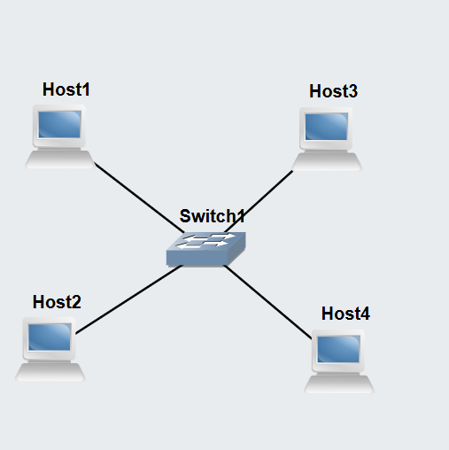
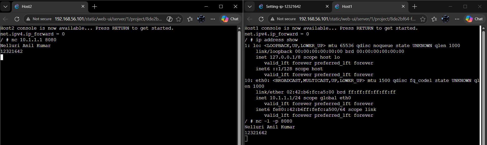
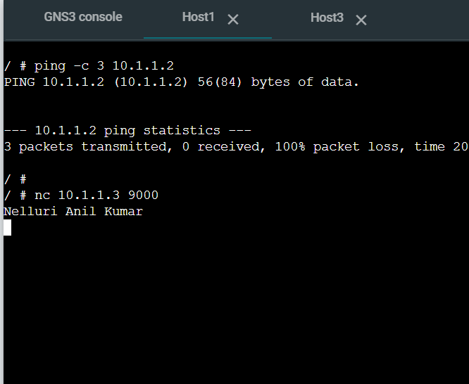
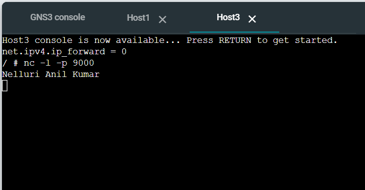

# Network Communications & Packet Capture 

## Task 1: Simple Application Communications with Netcat

1. Launched the Setting-IP-12321642 GNS3 topology containing four Linux hosts and an Ethernet switch.
2. Configured **Host 1** as the Netcat server listening on custom port 8080:
   nc -l -p 8080
3. Connected Host B as the Netcat client to Host A's IP address:
     nc 10.1.1.1 8080
4. Transmitted required messages across the active terminal sessions:
  -  Sent Full Name from client (Host B) to server (Host A).
  -  Sent Student ID from server (Host A) to client (Host B).
    
 5. Terminated both connections using Ctrl+D
## Task 2: Capturing Network Packets in GNS3  
- Key Steps ExecutedLink Capture Initiation:Right-clicked the link connecting Host A to the Ethernet Switch and selected Start capture (Ethernet link type).  
- Traffic Generation:ICMP Echo Requests: Sent 3 ping packets from Host A to Host B:  Bashping -c 3 <Host_B_IP>
- Netcat Data Payload: Transmitted student name from Host A to Host C via Netcat:  Bashnc <Host_C_IP> 8080
- Capture File Retrieval:Stopped link capture in GNS3.Established an SFTP connection to the GNS3 VM via FileZilla (gns3 / gns3).Navigated to /opt/gns3/projects/<project-id>/project-files/captures/ and downloaded the packet capture file.
 
 
- Downloaded .pcap file uploaded in images folder
