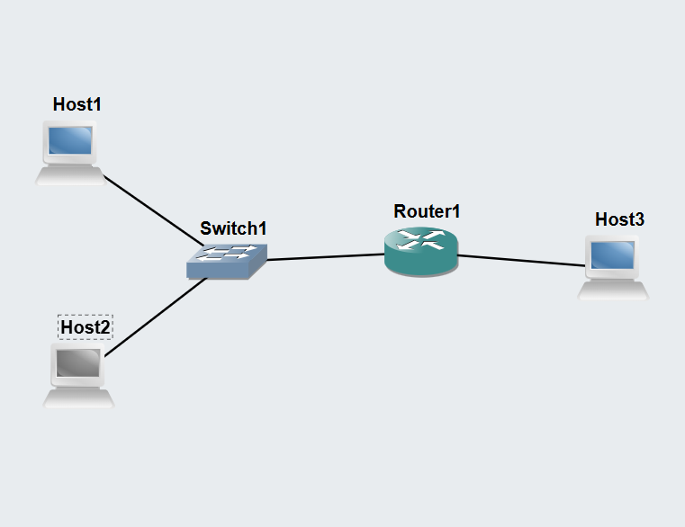
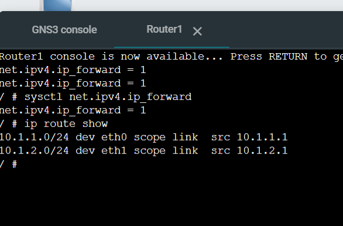
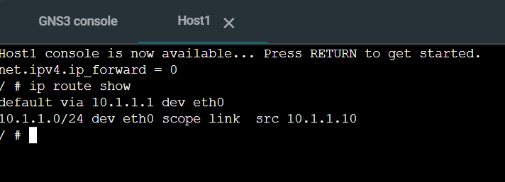
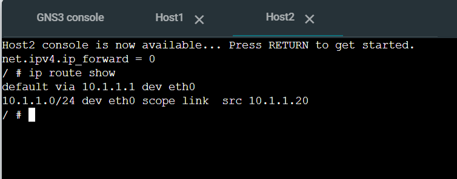
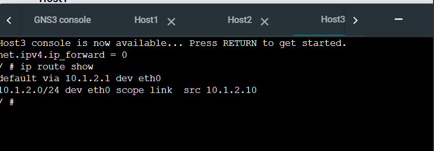
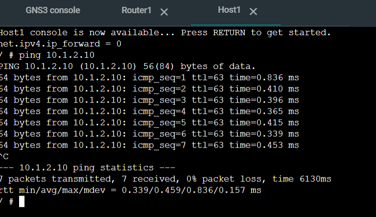

## Task 1: View Routing Tables & IP Forwarding

## 1. Topology Creation
1. Open GNS3 and create a new project named `View-Routes-12321642`.
2. Drag and drop the following nodes onto the canvas:
   * **3x Linux Host** nodes (Rename: `Host1`, `Host2`, `Host3`)
   * **1x Linux Router** node (Rename: `Linux-Router`)
   * **1x Ethernet Switch** node (Rename: `Switch1`)
3. Connect the devices using the **Add a Link** tool:
   * Connect `Host1` interface `eth0` $\rightarrow$ `Switch1` port `Ethernet0`
   * Connect `Host2` interface `eth0` $\rightarrow$ `Switch1` port `Ethernet1`
   * Connect `Switch1` port `Ethernet2` $\rightarrow$ `Linux-Router` interface `eth0`
   * Connect `Linux-Router` interface `eth1` $\rightarrow$ `Host3` interface `eth0`

#### 2. Device Network Configuration (`/etc/network/interfaces`)
Before starting any node, configure its static IP address, subnet mask, default gateway, and packet forwarding status.

* **Host 1 Configuration**:
 
     ```ini
     auto eth0
     iface eth0 inet static
         address 10.1.1.10
         netmask 255.255.255.0
         gateway 10.1.1.1
         up sysctl net.ipv4.ip_forward=0
     ```

* **Host 2 Configuration**:
  
     ```ini
     auto eth0
     iface eth0 inet static
         address 10.1.1.20
         netmask 255.255.255.0
         gateway 10.1.1.1
         up sysctl net.ipv4.ip_forward=0
     ```

* **Linux Router Configuration**:

     ```ini
     auto eth0
     iface eth0 inet static
         address 10.1.1.1
         netmask 255.255.255.0
         up sysctl net.ipv4.ip_forward=1

     auto eth1
     iface eth1 inet static
         address 10.1.2.1
         netmask 255.255.255.0
         up sysctl net.ipv4.ip_forward=1
     ```

* **Host 3 Configuration**:

     ```ini
     auto eth0
     iface eth0 inet static
         address 10.1.2.10
         netmask 255.255.255.0
         gateway 10.1.2.1
         up sysctl net.ipv4.ip_forward=0
     ```

---

### Verification & Terminal Output Analysis

2. **Verify IP Forwarding Status**:
     ```bash
     $ sysctl net.ipv4.ip_forward
     net.ipv4.ip_forward = 1
     ```
   

3. **Inspect Kernel Routing Tables (`ip route show`)**:
   * Executing on **Host1**:  
   
   * Executing on **Host2**:  
     
   * Executing on **Host3**:  
      

4. **Test connectivity**  
   

## Task 2: Dynamic Routing with OSPF (FRRouting)

### Step-by-Step GNS3 GUI Setup

#### 1. Importing & Launching Template
1. Go to **File** $\rightarrow$ **Import portable project**.
2. Select `OSPF-Basics-Template.gns3project` and duplicate/save it as `OSPF-Basics-<studentid>.gns3project`.
3. Click the **Green Play Button** to power on all devices.
4. **Boot Wait Time**: Allow 2–3 minutes for the FRRouting (FRR) daemons to boot. Wait until the nodes load the `frr#` or `frr:~#` shell.

#### 2. Accessing FRR Interactive CLI (`vtysh`)
1. Right-click **FRR1** $\rightarrow$ select **Console**.
2. If greeted with the standard Linux prompt (`frr:~#`), enter the VTY shell:
   ```bash
   frr:~# vtysh
